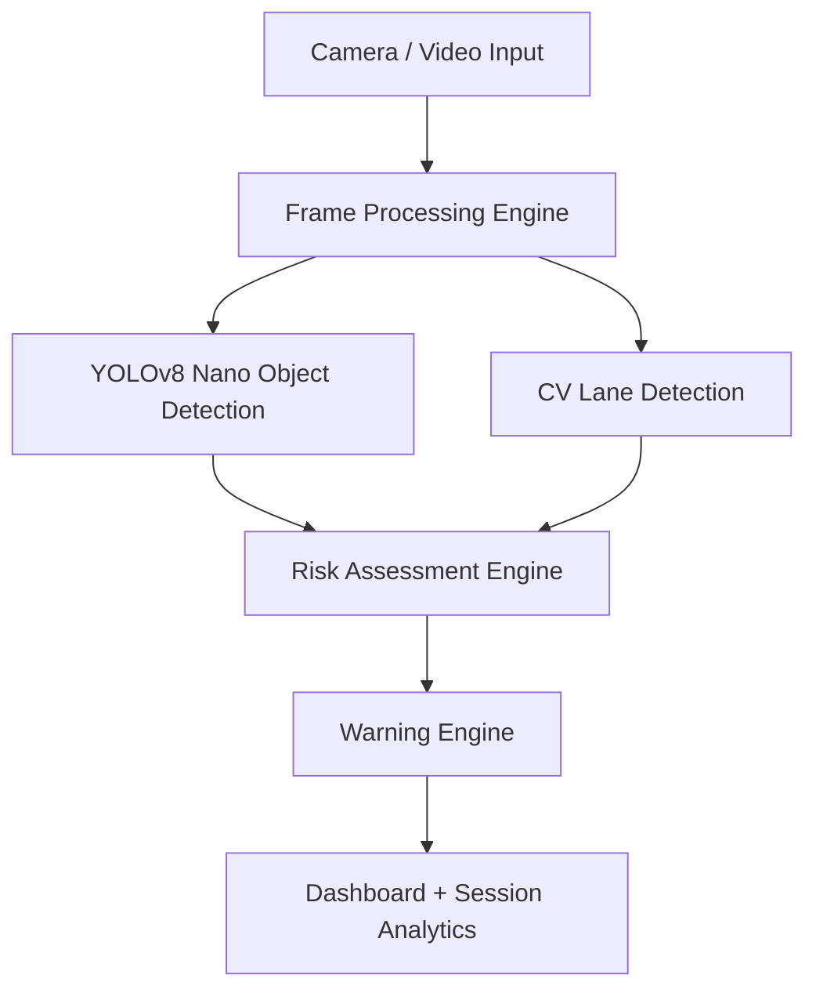

# RAASTA AI
> **See the Risk Before It Reaches You**

## Problem Statement
Road accidents remain a major global crisis, largely caused by delayed driver reaction times. Many Advanced Driver Assistance Systems (ADAS) are expensive, cloud-dependent, or integrated only into newer luxury vehicles.

## Proposed Solution
**RAASTA AI** is a software-only Edge AI-based ADAS proof-of-concept. It analyzes road video locally, identifying potential driving hazards in real-time, estimating collision risk, and tracking lane boundaries without relying on costly hardware or cloud APIs.

## Key Features
- **Real-Time Object Detection**: Detects vehicles, pedestrians, cyclists, and traffic elements.
- **Driving Corridor Analysis**: Defines a dynamic risk zone to prioritize immediate forward threats.
- **Collision Risk Estimation**: Visual-spatial risk scoring (Safe, Caution, Warning, Critical).
- **Lane Detection (Experimental)**: Classical CV-based lane boundary tracking.
- **Context-Aware Warnings**: Intelligent debouncing to prevent alert fatigue.
- **Offline Capable**: 100% local edge inference.
- **Session Analytics**: End-of-trip safety summary and metrics.

## System Architecture



## Technology Stack
- **AI / Computer Vision**: Python, OpenCV, Ultralytics YOLOv8 Nano, NumPy
- **Frontend / Dashboard**: Streamlit, Pandas
- **Edge Inference**: Local PyTorch execution (ONNX-ready architecture)

## Edge AI Justification
This project specifically aligns with Edge AI paradigms by removing network dependency. In an automotive environment, latency to a cloud server can mean the difference between a safe stop and a collision. By processing frames entirely locally using lightweight models (YOLO nano), we achieve the necessary speed and privacy for real-time safety systems.

## Installation Instructions

1. Clone or download the repository.
2. Ensure you have Python 3.8+ installed.
3. Install dependencies:
   ```bash
   pip install -r requirements.txt
   ```
4. Add a sample dashcam or road video named `demo.mp4` into the `sample_videos/` directory.

## Run Command
```bash
streamlit run app.py
```

## Demo Workflow
1. Open the Raasta AI dashboard.
2. Note the **Edge Intelligence** panel confirming local offline inference.
3. Select a video to upload, or check "Use Demo Video".
4. Click **Start Analysis**.
5. Observe the vehicles and pedestrians detected in real-time.
6. Note how objects entering the yellow driving corridor trigger higher risk scores.
7. Observe context-aware warnings (e.g., "CRITICAL: PEDESTRIAN AHEAD").
8. Review the final Session Summary report once the video concludes.

## Current Limitations
- **Proof of Concept**: This is a software PoC, not a certified automotive safety system. Do not rely on this for actual driving.
- **No Distance Calibration**: Visual risk estimation relies on relative bounding box area, which is not equivalent to physical distance measurement.
- **Environmental Factors**: Lane detection may struggle in poor lighting, rain, or on unpainted roads.
- **No Vehicle Actuation**: The current PoC only alerts and does not physically brake or steer.

## Future Enhancements
- Object tracking across frames (DeepSORT/ByteTrack).
- Time-to-Collision (TTC) physical estimation.
- Driver drowsiness detection via cabin camera.
- Deployment optimization for NVIDIA Jetson / Raspberry Pi via TensorRT.
